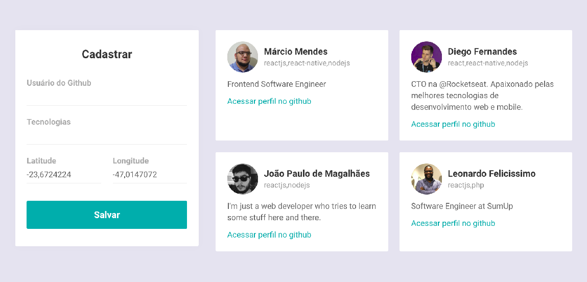
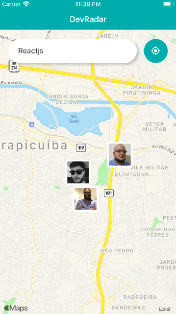

<h1 align="center">
  
</h1>

<h2 align="center">
  DevRadar
</h2>

<h4 align="center">
   Find a <strong>dev</strong> closer to you
</h4>

  

  

  

## Getting Started

This project was developed following the challenges of [Semana Omnistack da RocketSeat](https://rocketseat.com.br/).

`Challenge` - Develop an application that a user could find another devs in github who knows the same tecnologies and are less than 10km away from him.

## Prerequisites

Before continue, check that you have completed the following requirements:

- [**nodejs**](https://nodejs.org) - A javascript runtime - _tested on v10.16.0_
- [**expo**](https://expo.io/) - open-source platform for making universal native apps

## DevRadar Structure

### devradar-backend

- A simple backend app using for CRUD operations and Search

  - `yarn dev` - start the backend application

  - `routes`

    - `/devs` - use CRUD operations to manage your devs
    - `/search`- find the devs using techs and location

    > you could find detailed request examples inside `docs/insomnia-devradar.json` file

### devradar-web

  

    
    
The admin where you could register new devs defining the location and the tecnologies

  

- `yarn start` - Start the web application

### devradar-mobile

  

    
    
The <strong>mobile</strong> client where the user could search for another devs 

  

- `yarn start` - Start the mobile version using expo

## Built With

- 📦 [Nodejs](https://nodejs.org/en/) - JavaScript runtime
- 📦 [ReactJS](https://reactjs.org/)  - JavaScript library for user interfaces
- 📦 [Expo](https://expo.io/) - open-source platform for making universal native apps

## Author

- **Marcio Mendes** - [mmendesas](https://github.com/mmendesas)

## License

This project is licensed under the MIT License
